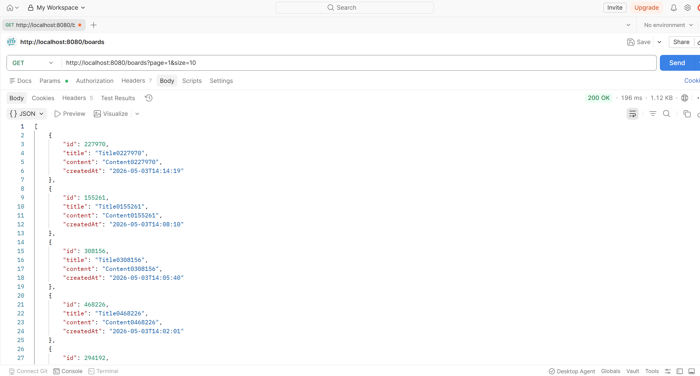
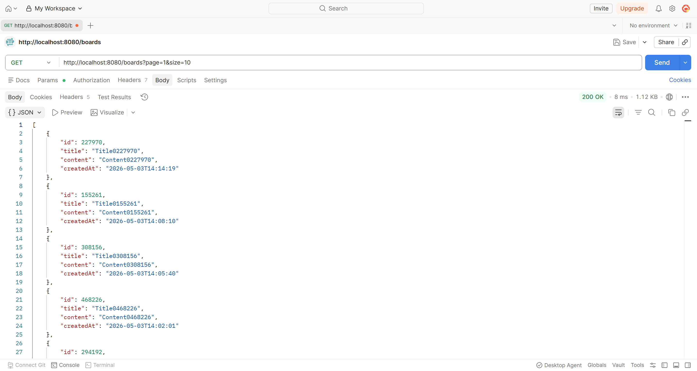

# Week 02 - 신진수

## 1. 이번 주 학습 내용 요약

- 캐시(Cache)와 캐싱(Caching) 개념 이해
- Cache Aside, Write Around 전략과 각 전략의 한계와 극복 방법 학습
- 데이터 조회 성능 개선 방법의 종류와 SQL 튜닝을 우선 고려해야 하는 이유
- Spring Boot 3.5 + MySQL 8 + Redis 환경에서 캐싱 실습 (Docker 기반)
- Redis 적용 전후 응답 속도 직접 측정: **200ms → 8ms (약 25배 개선)**

---

## 2. 실습 과정과 핵심 코드 또는 명령어

### 캐싱 전략 개념 정리

**Cache Aside (= Look Aside = Lazy Loading) 전략**

> 캐시에서 데이터를 확인하고, 없다면 DB를 통해 조회해오는 방식

- **Cache Hit**: 요청한 데이터가 캐시에 있는 경우 → 캐시에서 바로 응답
- **Cache Miss**: 요청한 데이터가 캐시에 없는 경우 → DB에서 조회 후 캐시에 저장

**Write Around 전략**

> 쓰기 작업(저장, 수정, 삭제)을 캐시에는 반영하지 않고, DB에만 반영하는 방식

Cache Aside + Write Around를 함께 사용하는 경우가 많다.

**두 전략의 한계**

| 한계 | 원인 | 극복 방법 |
|------|------|-----------|
| 캐시와 DB 데이터 불일치 (데이터 일관성 보장 불가) | 수정 시 DB만 업데이트하기 때문 | TTL 설정으로 주기적으로 데이터 갱신 |
| 캐시 저장 공간의 한계 | 캐시는 메모리(RAM) 기반 | TTL 설정으로 미사용 데이터 자동 삭제 |

**캐시 적용에 적합한 데이터**
- 자주 조회되는 데이터
- 잘 변하지 않는 데이터
- 실시간으로 정확하게 일치하지 않아도 되는 데이터

---

### 데이터 조회 성능 개선 방법

- SQL 튜닝
- 캐싱 서버 활용 (Redis 등)
- 레플리케이션 (Master/Slave 구조)
- 샤딩
- DB 스케일업

**SQL 튜닝을 먼저 고려해야 하는 이유**

1. 나머지 방법은 시스템을 추가로 구축해야 하므로 금전적·시간적 비용과 관리 비용이 증가한다. SQL 튜닝은 기존 시스템 변경 없이 성능을 개선할 수 있다.
2. SQL 자체가 비효율적으로 작성됐다면 시스템 개선만으로는 한계가 있다. 근본적인 문제를 먼저 해결하는 것이 가성비가 좋다.

---

### 실습 환경

| 항목 | 버전 / 설정 |
|------|-------------|
| Spring Boot | 3.5.0 |
| Java | 21 |
| MySQL | 8.0 (Docker, port 3307) |
| Redis | latest (Docker, port 6379) |
| 더미 데이터 | boards 테이블 100만 건 |

**Docker 컨테이너 실행**

```bash
# MySQL
docker run -d --name mysql-board \
  -e MYSQL_ROOT_PASSWORD=password \
  -e MYSQL_DATABASE=mydb \
  -p 3307:3306 \
  mysql:8.0

# Redis
docker run -d --name redis -p 6379:6379 redis
```

---

### Spring Boot + Redis 셋팅

**build.gradle**

```groovy
dependencies {
    implementation 'org.springframework.boot:spring-boot-starter-data-jpa'
    implementation 'org.springframework.boot:spring-boot-starter-data-redis'
    implementation 'org.springframework.boot:spring-boot-starter-web'
    developmentOnly 'org.springframework.boot:spring-boot-devtools'
    runtimeOnly 'com.mysql:mysql-connector-j'
}
```

**application.yml**

```yaml
server:
  port: 8080

spring:
  profiles:
    default: local
  datasource:
    url: jdbc:mysql://localhost:3307/mydb
    username: root
    password: password
    driver-class-name: com.mysql.cj.jdbc.Driver
  jpa:
    hibernate:
      ddl-auto: update
    show-sql: true
  data:
    redis:
      host: localhost
      port: 6379

logging:
  level:
    org.springframework.cache: trace
```

**RedisConfig.java**

```java
@Configuration
public class RedisConfig {
    @Value("${spring.data.redis.host}")
    private String host;

    @Value("${spring.data.redis.port}")
    private int port;

    @Bean
    public LettuceConnectionFactory redisConnectionFactory() {
        return new LettuceConnectionFactory(new RedisStandaloneConfiguration(host, port));
    }
}
```

**RedisCacheConfig.java**

```java
@Configuration
@EnableCaching
public class RedisCacheConfig {
    @Bean
    public CacheManager boardCacheManager(RedisConnectionFactory redisConnectionFactory) {
        RedisCacheConfiguration redisCacheConfiguration = RedisCacheConfiguration
            .defaultCacheConfig()
            .serializeKeysWith(
                RedisSerializationContext.SerializationPair.fromSerializer(new StringRedisSerializer()))
            .serializeValuesWith(
                RedisSerializationContext.SerializationPair.fromSerializer(
                    new Jackson2JsonRedisSerializer<>(Object.class)))
            .entryTtl(Duration.ofMinutes(1L));

        return RedisCacheManager.RedisCacheManagerBuilder
            .fromConnectionFactory(redisConnectionFactory)
            .cacheDefaults(redisCacheConfiguration)
            .build();
    }
}
```

**BoardService.java - `@Cacheable` 적용**

```java
@Cacheable(
    cacheNames = "getBoards",
    key = "'boards:page:' + #page + ':size:' + #size",
    cacheManager = "boardCacheManager"
)
public List<Board> getBoards(int page, int size) {
    Pageable pageable = PageRequest.of(page - 1, size);
    Page<Board> pageOfBoards = boardRepository.findAllByOrderByCreatedAtDesc(pageable);
    return pageOfBoards.getContent();
}
```

`@Cacheable` 어노테이션이 Cache Aside 전략을 구현해준다. 요청이 들어오면 Redis를 먼저 확인하고, Cache Hit이면 DB 조회 없이 바로 응답한다.

| 속성 | 설명 |
|------|------|
| `cacheNames` | 캐시 이름 |
| `key` | Redis에 저장할 Key (네이밍 컨벤션 적용) |
| `cacheManager` | 사용할 CacheManager Bean 이름 |

**Redis CLI로 캐싱 확인**

```bash
$ docker exec -it redis redis-cli

$ KEYS *                                     # 저장된 모든 key 조회
$ GET getBoards::boards:page:1:size:10       # 특정 key의 value 조회
$ TTL getBoards::boards:page:1:size:10       # 특정 key의 TTL 조회 (초 단위)
```

실제 조회 결과:

```
127.0.0.1:6379> KEYS *
1) "getBoards::boards:page:1:size:10"

127.0.0.1:6379> TTL getBoards::boards:page:1:size:10
(integer) 60
```

---

### 더미 데이터 생성 SQL (MySQL 8.0+)

```sql
SET SESSION cte_max_recursion_depth = 1000000;

INSERT INTO boards (title, content, created_at)
WITH RECURSIVE cte (n) AS (
    SELECT 1
    UNION ALL
    SELECT n + 1 FROM cte WHERE n < 1000000
)
SELECT
    CONCAT('Title', LPAD(n, 7, '0')),
    CONCAT('Content', LPAD(n, 7, '0')),
    TIMESTAMP(DATE_SUB(NOW(), INTERVAL FLOOR(RAND() * 3650 + 1) DAY)
        + INTERVAL FLOOR(RAND() * 86400) SECOND)
FROM cte;
```

---

## 3. 문제 해결 과정 또는 트러블슈팅

### Redis 적용 전후 성능 비교 (Postman)

| 구분 | 응답 속도 |
|------|----------|
| Redis 적용 전 | 약 200ms |
| Redis 적용 후 (Cache Hit 기준) | 약 8ms |

> 첫 요청(JVM 워밍업 영향)을 제외한 이후 4회 평균 수치다.

**결과**: 약 25배 응답 속도 향상

**Redis 적용 전**



**Redis 적용 후**



---

### 첫 요청이 유독 느린 이유는 뭐 였을까 (400~600ms)

Redis 적용 전후와 상관 없이 서버 재시작 직후 첫 요청은 항상 느렸다. 이유를 찾아봤다.

**1. JVM JIT 컴파일 워밍업**

JVM은 처음에 코드를 인터프리터 방식으로 실행하다가, 자주 호출되는 코드를 감지하면 네이티브 기계어로 컴파일(JIT)한다. 첫 몇 번의 요청은 이 컴파일이 완료되기 전이라 느리다. `@Cacheable`처럼 AOP 프록시로 동작하는 기능도 첫 호출 시 리플렉션 메타데이터를 구성하는 오버헤드가 있다.

**2. HikariCP 커넥션 풀**

서버 시작 시 DB 커넥션이 풀에 미리 만들어지지만, 실제 첫 쿼리가 나갈 때 TCP 핸드셰이크나 MySQL 인증 등 실질적인 연결 비용이 한 번 더 발생한다.

**3. InnoDB 버퍼 풀 (MySQL)**

MySQL은 자주 읽는 데이터를 메모리(InnoDB 버퍼 풀)에 올려둔다. 서버 재시작 직후에는 버퍼가 비어 있어 디스크에서 읽어야 하고, 이후에는 메모리에서 읽어 빠르다.

**4. 클래스 로딩**

Java는 클래스를 처음 사용할 때 로드한다. 첫 요청은 JPA, Jackson, 직렬화 관련 클래스들이 로드되는 타이밍과 겹친다.

**실무에서는** 배포 직후 트래픽을 받기 전에 워밍업 요청을 미리 보내는 방식(`/actuator/health` 호출 등)으로 이 문제를 완화한다고 한다.

---

### `@EnableCaching` 빠드리지 않도록 주의하기!

처음에 `RedisCacheConfig`에 `@EnableCaching`을 빠뜨렸는데, `@Cacheable`을 붙여도 캐싱이 전혀 적용되지 않았다. Spring 캐싱 기능 자체가 꺼져 있으니 당연한 결과였다. 추가하고 나서야 정상 동작했다.

---

### Redis CLI에서 키가 안 보여서 당황했던 경험

API를 호출하고 캐싱이 됐나 싶어서 `KEYS *`를 쳐봤더니 아무것도 안 나왔다. 캐싱이 안 된 건가 싶어서 당황했는데, TTL을 1분으로 설정해뒀기 때문에 확인하러 가는 사이에 이미 만료가 됐던 것이었다. API를 호출하자마자 바로 `KEYS *`를 치니까 정상적으로 보였다.

---

## 4. 추가 학습 내용

**캐시 쇄도(Cache Stampede)와 지터(Jitter)**

이번 실습에서 `RedisCacheConfig`에 TTL을 1분으로 고정했다. 그런데 만약 이 게시판 서비스에 사용자가 많아진다면 어떨까? 1분마다 TTL이 동시에 만료되는 순간, 수많은 요청이 한꺼번에 Cache Miss를 겪고 DB로 몰리게 된다. 이를 '캐시 쇄도(Cache Stampede)'라고 한다.

실습처럼 TTL을 고정값으로 설정하는 방식은 구현이 간단하고 캐시 갱신 시점을 예측할 수 있다는 장점이 있다. 하지만 동일한 캐시를 수많은 사용자가 동시에 요청하는 서비스라면 TTL 만료 시점마다 DB에 부하가 집중되어 장애로 이어질 수 있다.

**해결책: 지터(Jitter)**

TTL에 무작위 지연을 조금씩 더해주면 캐시가 분산되어 만료되므로 DB 부하를 시간에 걸쳐 완화할 수 있다. 전자공학에서 신호를 읽을 때 발생하는 짧은 지연을 '지터'라고 부르는데, 같은 개념을 캐시 만료에 적용한 것이다.

이번 실습 코드에 적용한다면 아래처럼 바꿀 수 있다.

```java
// 기존: TTL 고정
.entryTtl(Duration.ofMinutes(1L));

// 지터 적용: 60~70초 사이 무작위 만료
long jitter = ThreadLocalRandom.current().nextLong(10);
.entryTtl(Duration.ofSeconds(60 + jitter));
```

단, 지터가 길어질수록 사용자가 더 오래된 데이터를 볼 수 있으므로 서비스 특성에 맞게 최대 지터 시간을 조절해야 한다.

참고: [토스 기술 블로그 - 캐시 트래픽 팁](https://toss.tech/article/cache-traffic-tip)

---

## 5. 다음 주에 확인할 질문 또는 논의 포인트

- Cache Stampede가 실제 서비스에서 발생했을 때 어떻게 대응하는가?
- `@Cacheable` 외에 `@CacheEvict`, `@CachePut`은 어떤 상황에서 쓰는가?
