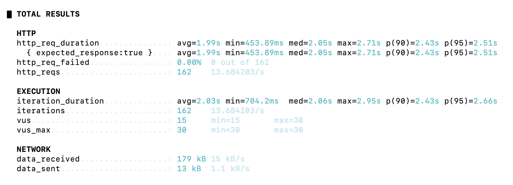
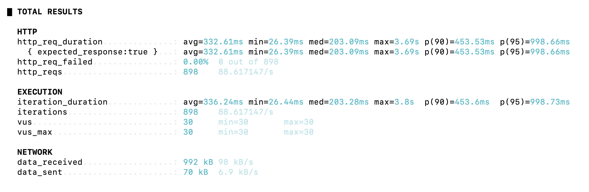

# Week 03 - 유서연

## AWS EC2에서 Redis 활용하기

### EC2, RDS, Spring Boot, Redis 세팅

AWS EC2에서 Redis를 활용하려면 다음과 같이 AWS를 세팅해야 한다!

- EC2
  - Spring Boot 서버 실행
  - Redis 설치 및 실행
  - JDK 17 설치
  - 보안 그룹에서 8080번 포트 개방
  - `t3.small` 이상 권장

- RDS
  - MySQL 사용
  - 보안 그룹에서 3306번 포트 개방
  - Spring Boot의 `application.yml` datasource URL과 DB 이름 일치 필요

- Redis
  - EC2 내부에 직접 설치
  - Spring Boot와 같은 EC2에서 실행되므로 `host: localhost` 사용
  - `redis-cli ping` 결과가 `PONG`이면 정상 실행

- Spring Boot 실행
  - Github Repository clone
  - `./gradlew clean build -x test`로 빌드
  - `build/libs`에서 jar 파일 실행
  - prod profile 사용

```bash
java -Dspring.profiles.active=prod -jar {빌드된 jar 파일명}
```

<br>

- application.yml 설정
  - local 환경: 로컬 MySQL + 로컬 Redis 사용
  - prod 환경: RDS MySQL 사용

<br>

```yaml
# local 환경
spring:
  profiles:
    default: local
  datasource:
    url: jdbc:mysql://localhost:3306/mydb
    username: root
    password: password
    driver-class-name: com.mysql.cj.jdbc.Driver
  jpa:
    hibernate:
      ddl-auto: update
    show-sql: true
  data:
    redis:
      host: localhost
      port: 6379

logging:
  level:
    org.springframework.cache: trace

---
# prod 환경
spring:
  config:
    activate:
      on-profile: prod
  datasource:
    url: jdbc:mysql://{rds 주소}:3306/mydb
    username: admin
    password: password
```

prod 환경에서도 Redis host가 `localhost`인 이유는 Spring Boot와 Redis가 같은 EC2 안에서 실행되기 때문이다.

즉, Spring Boot 입장에서는 Redis가 외부 서버가 아니라 같은 서버 내부의 6379번 포트에서 실행 중인 서비스이다.

<br>

### RDS에 더미 데이터 넣기

Redis 적용 전후 성능을 비교하려면 DB 조회 비용이 어느 정도 발생해야 한다.

따라서, RDS에 충분한 양의 더미 데이터를 넣어주어야 한다.

```sql
SET SESSION cte_max_recursion_depth = 1000000;

INSERT INTO boards (title, content, created_at)
WITH RECURSIVE cte (n) AS
(
  SELECT 1
  UNION ALL
  SELECT n + 1 FROM cte WHERE n < 1000000
)
SELECT
    CONCAT('Title', LPAD(n, 7, '0')) AS title,
    CONCAT('Content', LPAD(n, 7, '0')) AS content,
    TIMESTAMP(
      DATE_SUB(NOW(), INTERVAL FLOOR(RAND() * 3650 + 1) DAY)
      + INTERVAL FLOOR(RAND() * 86400) SECOND
    ) AS created_at
FROM cte;
```

DB GUI 툴로 RDS에 접속한 뒤, 위 SQL을 실행한다.

<br>

## Redis를 적용하기 전후 성능 비교하기

### Redis 적용 전 요청 흐름

Redis를 적용하지 않은 상태에서는 매 요청마다 RDS를 조회한다.

```text
Client
  ↓
Spring Boot
  ↓
RDS 조회
  ↓
응답 반환
```

같은 요청이 반복되어도 매번 DB를 조회해야 하므로, 데이터가 많거나 요청이 많아질수록 DB 부하가 커질 수 있다.

### Redis 적용 후 요청 흐름

Redis를 적용하면 첫 요청에서는 캐시에 데이터가 없기 때문에 DB를 조회한다.

```text
Client
  ↓
Spring Boot
  ↓
Redis 조회
  ↓ Cache Miss
RDS 조회
  ↓
Redis에 저장
  ↓
응답 반환
```

이후 같은 요청이 들어오면 Redis에 저장된 데이터를 바로 반환한다.

```text
Client
  ↓
Spring Boot
  ↓
Redis 조회
  ↓ Cache Hit
응답 반환
```

즉, Redis는 반복 조회가 많은 API에서 DB 접근 횟수를 줄여주는 역할을 한다.

### Redis 적용 코드

게시글 목록 조회 메서드에 `@Cacheable`을 적용한다.

```java
@Service
public class BoardService {
  ...

  @Cacheable(cacheNames = "getBoards", key = "'boards:page:' + #page + ':size:' + #size", cacheManager = "boardCacheManager")
  public List<Board> getBoards(int page, int size) {
    Pageable pageable = PageRequest.of(page - 1, size);
    Page<Board> pageOfBoards = boardRepository.findAllByOrderByCreatedAtDesc(pageable);
    return pageOfBoards.getContent();
  }
}
```

`cacheNames`는 캐시 영역의 이름이고, `key`는 캐시 데이터를 구분하는 기준이다.

위 코드에서는 `page`와 `size`가 같으면 같은 캐시 key를 사용한다.

예를 들어, 다음 요청은 같은 캐시 key를 사용한다.

```text
/boards?page=1&size=10
/boards?page=1&size=10
```

반대로 page나 size가 달라지면 다른 캐시 key가 만들어진다.

```text
/boards?page=1&size=10
/boards?page=2&size=10
```

따라서, Redis 캐싱 효과를 확인하려면 같은 요청을 반복해서 보내야 한다.

### Postman으로 응답 시간 비교하기

Redis를 적용했을 때는 여러 번 요청을 보내면 평균적으로 **약 20ms** 정도의 응답 속도가 나오는 것을 확인할 수 있다.

반대로 Redis를 적용하지 않은 상태를 확인하려면 `@Cacheable` 어노테이션을 주석 처리한다.

```java
@Service
public class BoardService {
  ...

  // @Cacheable(cacheNames = "getBoards", key = "'boards:page:' + #page + ':size:' + #size", cacheManager = "boardCacheManager")
  public List<Board> getBoards(int page, int size) {
    Pageable pageable = PageRequest.of(page - 1, size);
    Page<Board> pageOfBoards = boardRepository.findAllByOrderByCreatedAtDesc(pageable);
    return pageOfBoards.getContent();
  }
}
```

이 상태에서는 매 요청마다 RDS를 조회하게 된다.

여러 번 요청을 보내보면 평균적으로 **약 150ms** 정도의 응답 시간이 측정된다.

즉, Redis를 적용하지 않으면 같은 조회 요청이라도 매번 DB를 조회해야 하므로 응답 속도가 느려질 수 있다.

<br>

## 부하 테스트를 통한 Redis 적용 전후 성능 비교

### 부하 테스트란?

> 서버에 의도적으로 많은 요청을 보내고, 어느 정도의 부하까지 처리할 수 있는지 확인하는 것

백엔드 서버를 배포하기 전에 확인해야 할 것 중 하나는 서버가 어느 정도의 요청을 견딜 수 있는지이다.

실제 서비스에서는 여러 사용자가 동시에 요청을 보낼 수 있기 때문에, 단순히 API가 정상 동작하는지만 확인하는 것으로는 부족하다.

따라서, 의도적으로 많은 요청을 보내 서버의 처리 성능과 한계를 확인하는 부하 테스트를 진행한다.

### Throughput (처리량)

> 서버가 1초 동안 처리할 수 있는 요청 수

부하 테스트에서 자주 사용하는 지표 중 하나가 **Throughput**이다.

Throughput은 보통 TPS(Transaction Per Second)라는 단위로 표현한다.

예를 들어 서버가 1초에 100개의 API 요청을 처리할 수 있다면, 해당 서버의 처리량은 100 TPS라고 할 수 있다.


### k6란?

> 여러 명의 사용자가 동시에 요청을 보내는 상황을 시뮬레이션할 수 있는 부하 테스트 도구

실제 사용자가 직접 요청을 보내는 대신, k6가 가상 사용자를 만들어 API에 반복적으로 요청을 보낸다.


### k6 테스트 스크립트 작성

- `script.js` 파일 작성

```javascript
import http from 'k6/http';

export default function () {
  http.get('http://{EC2 IP 주소}:8080/boards');
}
```

위 스크립트는 EC2에서 실행 중인 Spring Boot 서버의 `/boards` API로 요청을 보내는 역할을 한다.

Redis 캐싱 효과를 더 정확히 확인하려면 같은 URL을 반복 요청하는 것이 좋다.

### k6 실행 명령어

- 부하 테스트 실행

```bash
k6 run --vus 30 --duration 10s script.js
```

- 각 옵션의 의미

```text
--vus 30
가상 사용자 30명이 동시에 요청을 보내는 상황을 의미한다.

--duration 10s
10초 동안 부하 테스트를 진행한다.
```

### Redis 적용 전 Throughput 측정

캐싱을 적용하지 않은 상태에서는 `@Cacheable`을 주석 처리한다.

```java
@Service
public class BoardService {
  ...

  // @Cacheable(cacheNames = "getBoards", key = "'boards:page:' + #page + ':size:' + #size", cacheManager = "boardCacheManager")
  public List<Board> getBoards(int page, int size) {
    Pageable pageable = PageRequest.of(page - 1, size);
    Page<Board> pageOfBoards = boardRepository.findAllByOrderByCreatedAtDesc(pageable);
    return pageOfBoards.getContent();
  }
}
```

이 상태에서는 모든 요청이 RDS로 전달된다.

서버를 빌드하고 백그라운드에서 실행한다.

```bash
./gradlew clean build -x test
cd build/libs
nohup java -Dspring.profiles.active=prod -jar {빌드된 jar 파일명} &
```

8080번 포트에서 서버가 실행 중인지 확인한다.

```bash
lsof -i:8080
```

그다음 로컬 환경에서 k6를 실행한다.

```bash
k6 run --vus 30 --duration 10s script.js
```



k6 결과를 보면 총 162개의 요청이 처리되었고, `http_reqs`는 약 `13.68/s`로 나타났다. 평균 응답 시간은 약 1.99초였다.

즉, 캐싱을 적용하지 않은 상태에서는 게시글 조회 요청마다 RDS를 직접 조회해야 하므로 응답 시간이 길어지고, 처리량도 상대적으로 낮게 측정되었다.

### Redis 적용 후 Throughput 측정

캐싱을 적용한 상태에서는 `@Cacheable` 주석을 해제한다.

```java
@Service
public class BoardService {
  ...

  @Cacheable(cacheNames = "getBoards", key = "'boards:page:' + #page + ':size:' + #size", cacheManager = "boardCacheManager")
  public List<Board> getBoards(int page, int size) {
    Pageable pageable = PageRequest.of(page - 1, size);
    Page<Board> pageOfBoards = boardRepository.findAllByOrderByCreatedAtDesc(pageable);
    return pageOfBoards.getContent();
  }
}
```

기존 서버를 종료한 뒤 다시 빌드하고 실행한다.

```bash
./gradlew clean build -x test

lsof -i:8080
kill {PID 값}

cd build/libs
nohup java -Dspring.profiles.active=prod -jar {빌드된 jar 파일명} &
```

다시 k6를 실행한다.

```bash
k6 run --vus 30 --duration 10s script.js
```



다시 테스트한 결과, 총 898개의 요청이 처리되었고 `http_reqs`는 약 `88.62/s`로 나타났다. 평균 응답 시간은 약 332.61ms였다.

즉, Redis를 적용한 상태에서 게시글 조회 API의 Throughput은 약 88.62 TPS라고 볼 수 있다.

### 성능 비교

| 상태 | 평균 응답 시간 | Throughput |
| --- | ---: | ---: |
| Redis 미적용 | 약 1.99s | 약 13.68 TPS |
| Redis 적용 | 약 332.61ms | 약 88.62 TPS |

즉, Redis 캐싱을 적용한 결과 처리량은 약 6.5배 증가했고, 평균 응답 시간은 약 1.99초에서 약 332ms로 감소했다.

<br>

